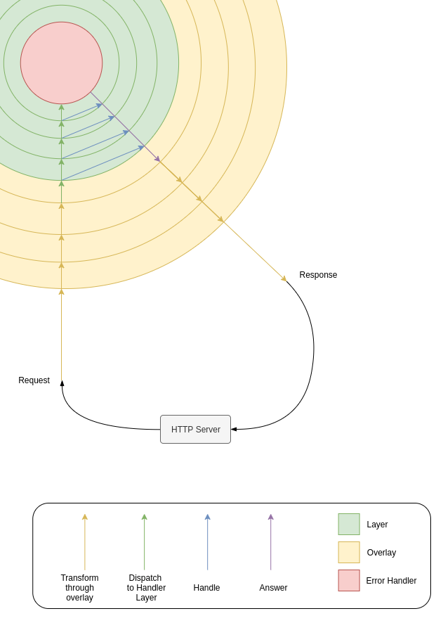

# Layer Model

This API organises the management of modules in a Layering model. In this model, 2 types of layer can be loaded as modules, Active layers, and filter Overlays.

_(See figure 1)._

## Reception

When a request is received through an HTTP server, it is transformed in each of the different overlays before being dispatched to the active layers. This transformation can be anything from logging to decryption.

## Handling

Once passed through all Overlays, the request is handled by the layers one by one, until either one of them answers or the request is passed through all of them without answer, in which case an error handler must respond accordingly.

## Answering

When an answer is generated it is transformed by the overlays in the reversed order in which the associated request came in, before being sent to the HTTP server to be processed in the network.

## Model

